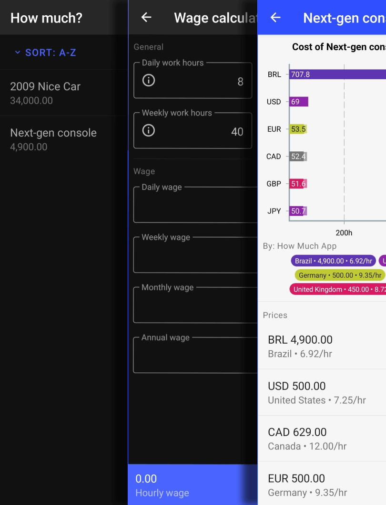

<h1 align="center">How much</h1> 

  

  How many hours you have to work to buy something?

  
  

  

  <!--  -->

  Get it on Expo Go

  

<!-- [BEGIN] Don't edit this section, instead run Markdown AIO: Update Table of Contents -->
## 🚩 Table of Contents

- [🚩 Table of Contents](#-table-of-contents)
- [🚀 Introduction](#-introduction)
- [🎨 Features](#-features)
- [💬 Contributing](#-contributing)
- [⭐ Acknowledgments](#-acknowledgments)
- [❤️ Donate](#️-donate)
- [📄 License](#-license)
<!-- [END] Don't edit this section, instead run Markdown AIO: Update Table of Contents -->

## 🚀 Introduction

Have you ever wondered how much your time is worth? Find out how many hours you have to work to buy something. Compare with other countries and currencies.

## 🎨 Features

* Compare products not by value, but by working hours.
* Get nice charts and share them.
* Share your products and findings with the world.

  

## 💬 Contributing

Would like to help make this app better? Please take a look at the [contributing guidelines](./CONTRIBUTING.md) for a detailed explanation on how you can contribute.

## ⭐ Acknowledgments

Become a contributor to see your name here!

## ❤️ Donate

|                                                                                  | Name    | Address                                    |
| :------------------------------------------------------------------------------: | ------- | ------------------------------------------ |
|   | Bitcoin | bc1qr4fw8vtwn25zu8d5cq26y4pw7jdml2quuyera7 |
|  | Ether   | 0x12B226943E97d57A35cC49055988687c14858876 |

## 📄 License
This project and it`s workspaces are licensed under the GPL-3.0 - see the [LICENSE](LICENSE) file for details
