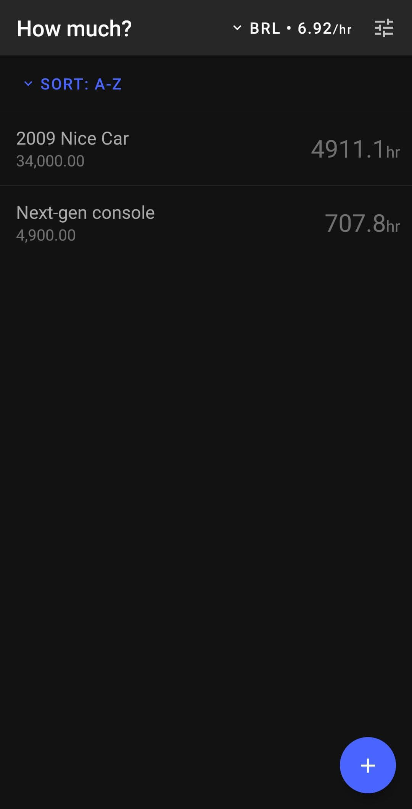
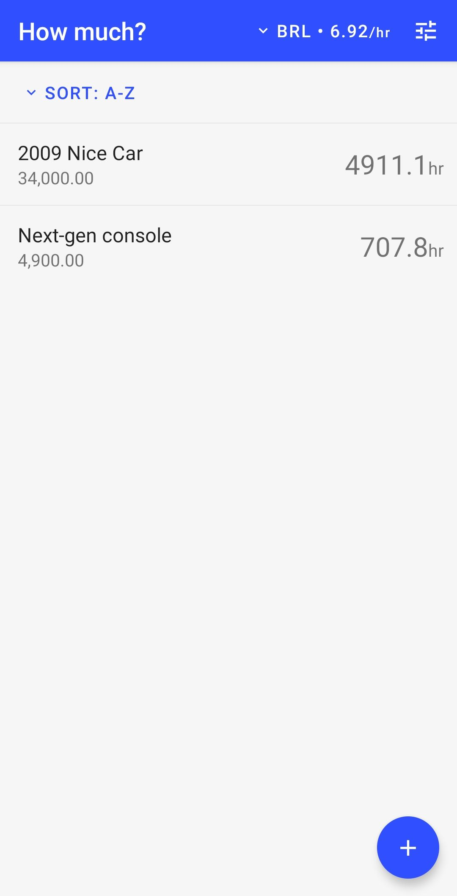
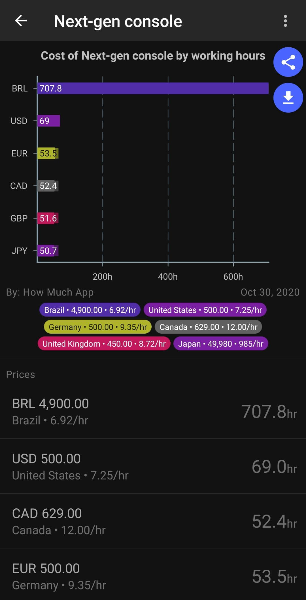
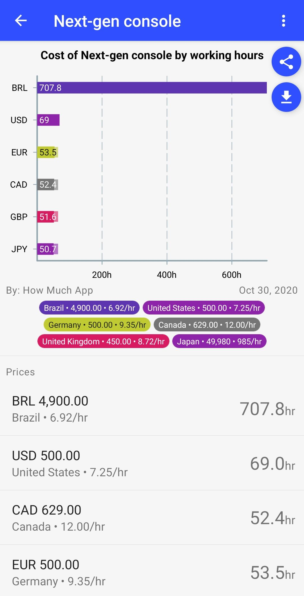
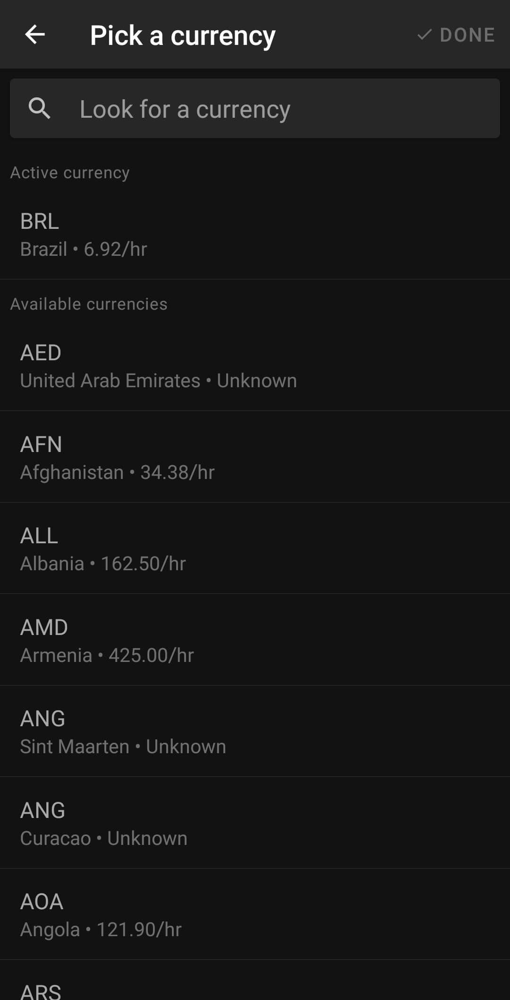
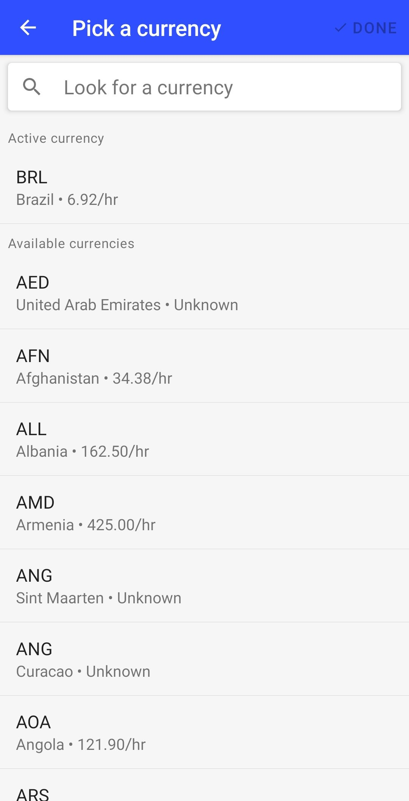
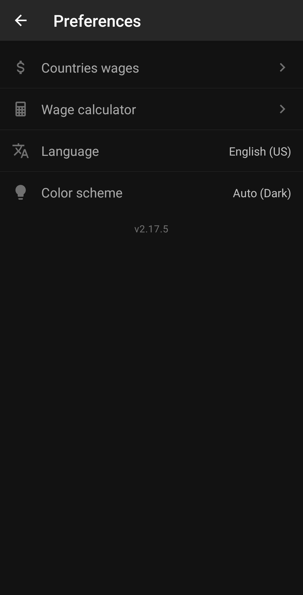
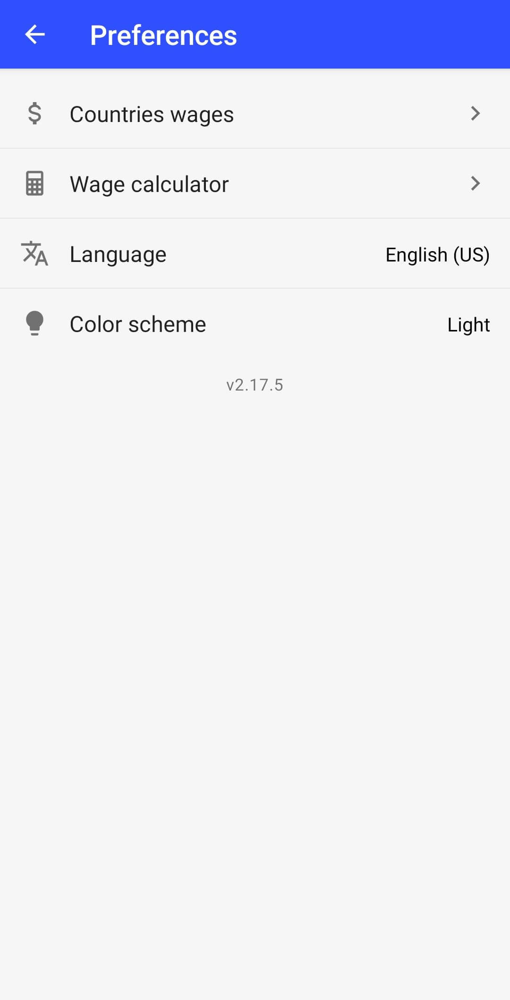
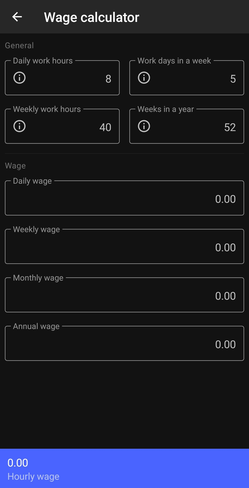
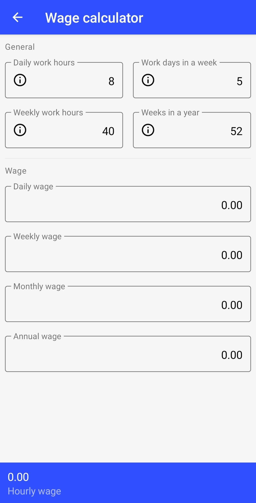

  

<h1 align="center">How much</h1>

  <strong>How many hours you have to work to buy something?</strong>

## Try it out
Get the latest version [here](https://github.com/DiogoAbu/how-much/releases/latest).

## Screenshots

| Dark                                                                                   | Light                                                                                        |
| -------------------------------------------------------------------------------------- | -------------------------------------------------------------------------------------------- |
|         |         |
|      |      |
|   |   |
|  |  |
|   |   |

## License
This project and it`s workspaces are licensed under the GPL-3.0 - see the [LICENSE](LICENSE) file for details
